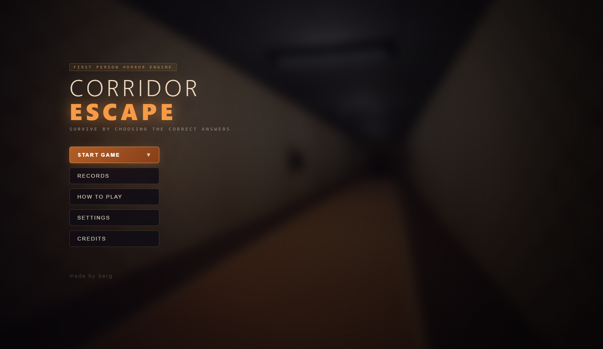
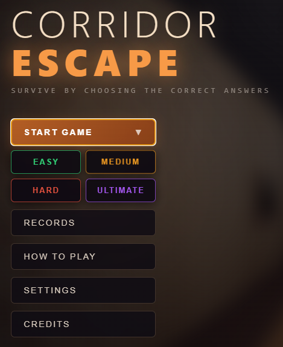
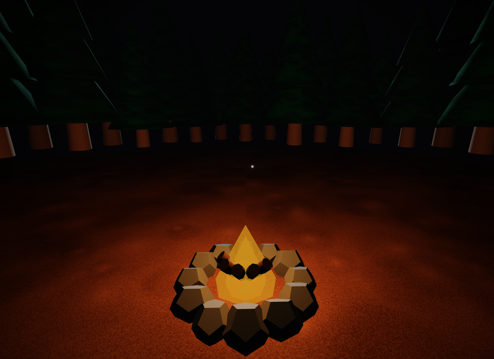
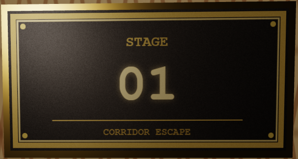
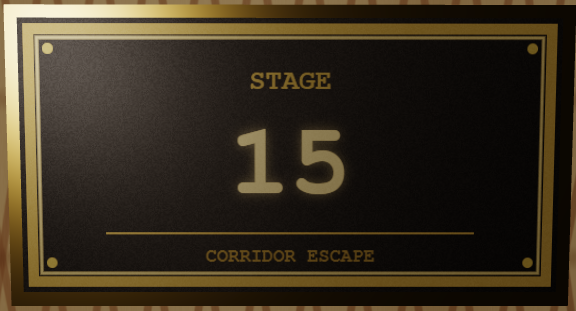
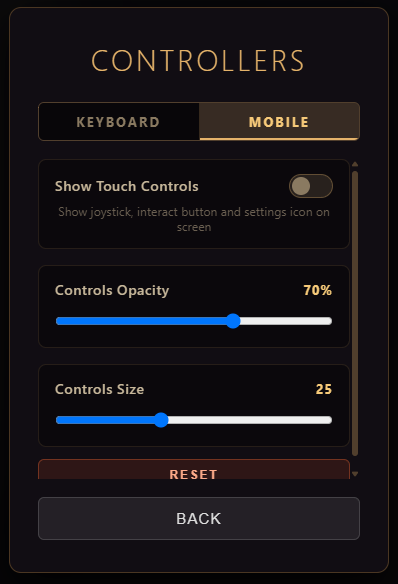

# Corridor Escape

Make your way through the corridors, answer the questions correctly, pass through 15 rooms, and reach victory. Choosing the wrong path risks losing your progress, forcing you to restart from Room 1.

  _ 
 

   _
  

---

## Key Features

* **Multi-Language Support:** The default game language is English, but there is also a Turkish option available for questions.
* **4 Difficulty Levels:** Dynamic question sets tailored to different challenge levels.
* **Achievement System:** When you finish the game, your score including your time and difficulty level, will be recorded in the high scores section.
* **Open Source:** Built entirely with HTML, JS, and CSS. Free of viruses and open-source.
* **There are various dynamic end screens; they appear randomly when the wrong door is selected.**

  
  

---

## Stages (corridors)

  
  

## Platform & Controls

* **PC (Recommended):** Designed for optimal performance on desktop computers. You can launch the game immediately via the CorridorEscape2.4.0.exe file available in the **Releases** section.
* **Mobile Compatibility:** While mobile devices are supported, performance may vary and could cause device heating during extended sessions. It runs on Android devices after being compiled as an APK (not recommended—the device gets hot)
* **Control Settings:** On-screen touch buttons are enabled by default for mobile support. If you are playing on a PC, it is recommended to disable on-screen controls in the **Settings** menu for a cleaner interface.

  

---

## How to Play

1. Download the latest `.exe` release from the **Releases** tab on the right.
2. Launch the application directly (no installation required).
3. Select your preferred language and difficulty level from the main menu.
4. Navigate through the rooms by answering the questions correctly.
5. **When you start the game, you can access the settings by pressing the ESC key. You can change all the settings from there and learn how to play the game.**
